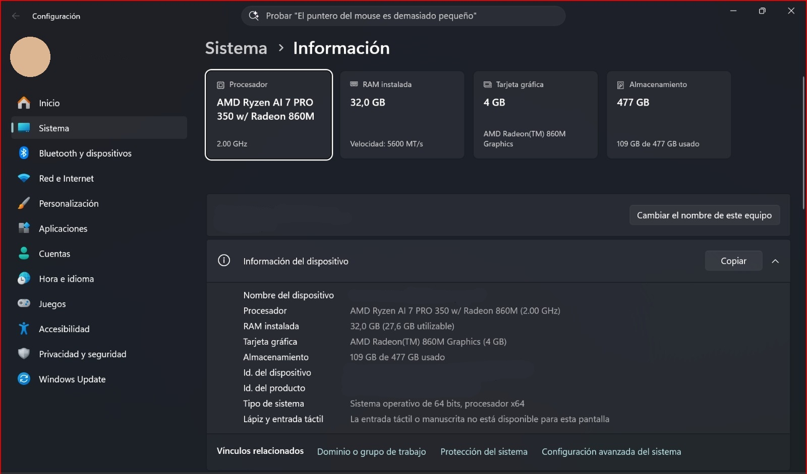
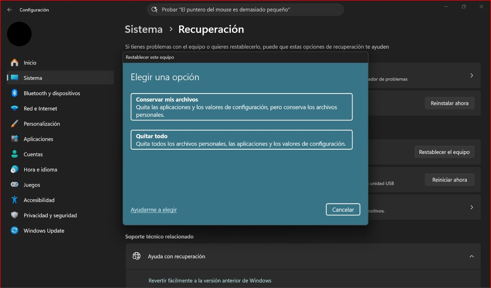
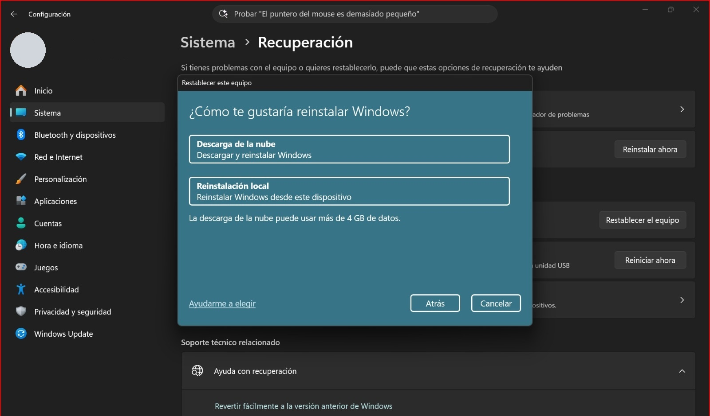
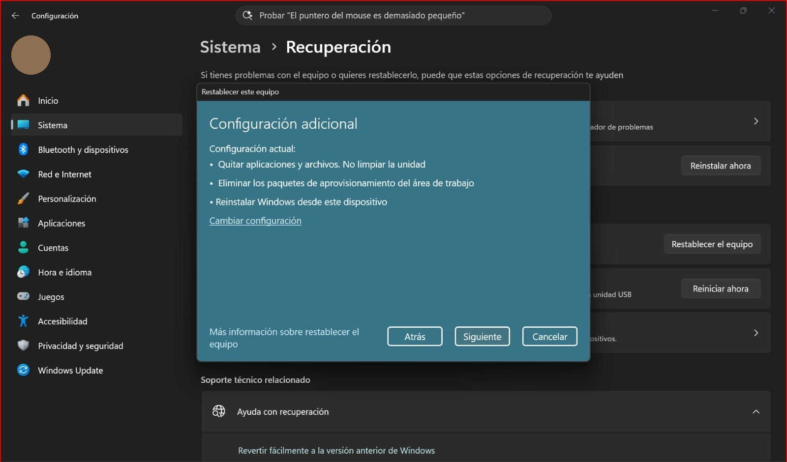
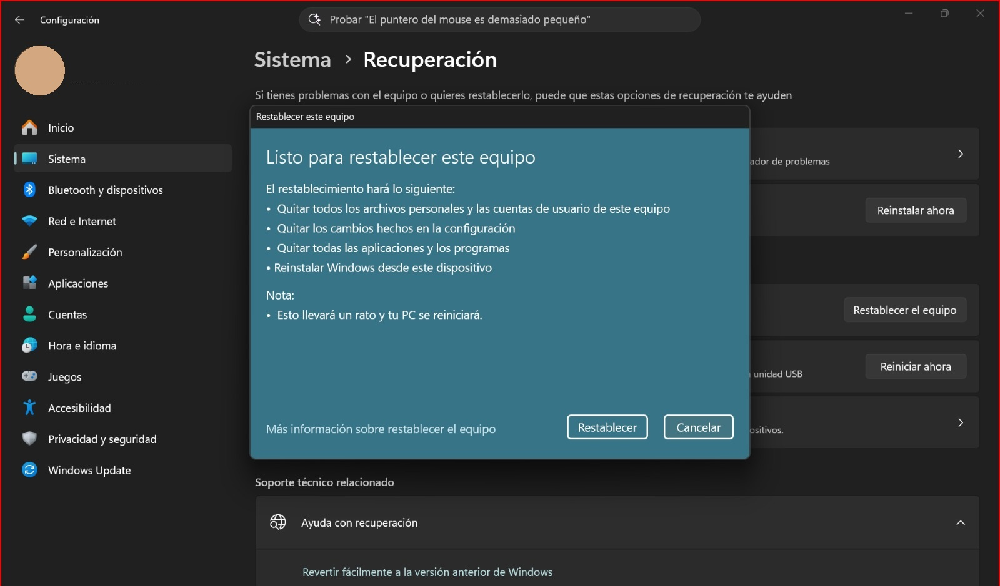
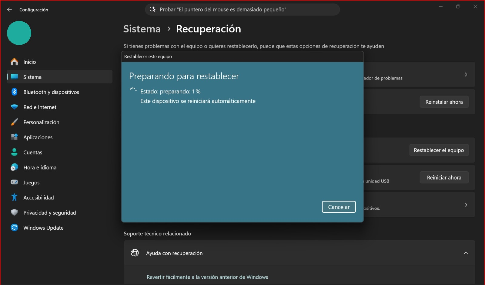

# manual-formateo
MANUAL DE SOPORTE TÉC. FORMATEO

# 🖥️ Manual de Formateo y Reinstalación de Windows

## 📌 Descripción
Este proyecto documenta el proceso completo de **formateo y reinstalación de Windows 11** en notebooks y PCs de escritorio. Incluye opciones de recuperación, reinstalación desde la nube o local, y configuración inicial del sistema.

## 🎯 Objetivo
- Proporcionar una guía clara y visual para técnicos y usuarios avanzados.  
- Estandarizar el procedimiento de soporte técnico en entornos Windows.  
- Ahorrar tiempo mediante pasos automatizados y documentados.

## 🛠️ Requisitos previos
- Pendrive booteable con Windows 10/11.  
- Acceso a BIOS/UEFI para configurar el arranque.  
- Conocimientos básicos de comandos en consola (Diskpart).  
- Conexión a internet (si se usa descarga desde la nube).

---

## 🚀 Procedimiento paso a paso

### PASO 1️⃣ - Información del Sistema
**Ubicación:** Configuración > Sistema > Información  
Verifica las especificaciones técnicas del equipo antes de proceder con el formateo.

---

### PASO 2️⃣ - Opciones de Recuperación
**Ubicación:** Configuración > Sistema > Recuperación  
Accede a las herramientas de restablecimiento del sistema.

---

### PASO 3️⃣ - Selección del Tipo de Restablecimiento
**Pantalla:** "Elegir una opción"  
Elige entre dos opciones:

- 🔹 **Conservar mis archivos**: mantiene documentos personales, elimina apps y configuraciones.  
- 🔹 **Quitar todo**: elimina absolutamente todo (archivos, apps, configuraciones).  

---

### PASO 4️⃣ - Método de Reinstalación
**Pregunta:** "¿Cómo te gustaría reinstalar Windows?"  

- 🌐 **Descarga desde la nube**: descarga la última versión de Windows (requiere internet y ~4 GB de datos).  
- 💾 **Reinstalación local**: reinstala desde la imagen existente en el dispositivo (más rápido, sin internet).  

---

### PASO 5️⃣ - Configuración Adicional
Revisa las opciones antes de confirmar.

- Quitar aplicaciones y archivos  
- No limpiar la unidad (seguridad)  
- Eliminar paquetes de aprovisionamiento  
- Reinstalar Windows desde este dispositivo  

---

### PASO 6️⃣ - Confirmación Final
Pantalla crítica: “Listo para restablecer este equipo”.

Resumen final:  
- Se eliminan archivos personales (si elegiste “Quitar todo”).  
- Se eliminan apps y configuraciones.  
- Se reinstala Windows automáticamente.  

⚠️ Importante:  
- Tu PC se reiniciará solo.  
- No desconectes la corriente.  
- Haz backup antes de confirmar.  

---
## 📊 Estadísticas del Proceso

| Fase | Tiempo Estimado | Acción |
|------|-----------------|--------|
| Selección de opciones | 2-5 min | Manual |
| Preparación | 5-15 min | Automático |
| Restablecimiento (local) | 20-30 min | Automático |
| Restablecimiento (nube) | 1-2 horas | Automático |
| Configuración inicial | 10-15 min | Manual |
| **TOTAL (local)** | **45-60 min** | - |
| **TOTAL (nube)** | **1-2 horas** | - |

---

## 🔒 Recomendaciones de Seguridad

### ✅ ANTES
- Backup de archivos importantes  
- Guardar contraseñas  
- Tener drivers listos  

### ⚠️ DURANTE
- Mantener el equipo conectado a corriente  
- No suspender ni hibernar  
- Internet estable si se usa nube  

### ✅ DESPUÉS
- Instalar drivers  
- Configurar usuario y contraseña  
- Instalar antivirus y apps necesarias  

---

## 📂 Estructura del Proyecto

---

## 🆘 Solución de Problemas Comunes

- ❌ **No puedo acceder a Recuperación** → Usa `Windows + I` > Sistema > Recuperación.  
- ❌ **El proceso se congela** → Espera, si no avanza reinicia forzadamente.  
- ❌ **No hay espacio suficiente** → Libera al menos 10 GB, borra temporales (`%temp%`).  
- ❌ **Se corta internet en reinstalación nube** → Restaura conexión, el proceso continúa solo.  

---

## 📋 Checklist Previo al Formateo

- [ ] Backup hecho  
- [ ] Contraseñas guardadas  
- [ ] Equipo conectado a corriente  
- [ ] Tiempo suficiente (mínimo 1 hora)  
- [ ] Drivers disponibles  
- [ ] Apps cerradas  
- [ ] Decisión confirmada  

---

## 📊 Estadísticas del Repositorio

  
  
  

---

**Última actualización:** 2026-06-07  
**Versión:** 2.0  
**Estado:** ✅ Completo con imágenes paso a paso

